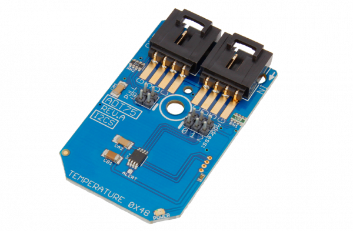

[](https://store.ncd.io/product/adt75-temperature-sensor-%C2%B11c-12-bit-with-3-address-lines-i2c-mini-module/).

# ADT75
ADT75 is a Temperature Sensor ±1°C 12-Bit with 3 Address Lines I2C Mini Module.
This Device is available from www.ncd.io

[SKU: ADT75_I2CS]

(https://store.ncd.io/product/adt75-temperature-sensor-%C2%B11c-12-bit-with-3-address-lines-i2c-mini-module/)
This Sample code can be used with Raspberry Pi.

Hardware needed to interface ADT75 Temperature Sensor With Raspberry Pi: 

1. <a href="https://store.ncd.io/product/adt75-temperature-sensor-%C2%B11c-12-bit-with-3-address-lines-i2c-mini-module/"> ADT75 is a Temperature Sensor ±1°C 12-Bit I2C Mini Module</a>
2.  <a href="https://store.ncd.io/product/i2c-shield-for-raspberry-pi-3-pi2-with-outward-facing-i2c-port-terminates-over-hdmi-port/">Raspberry Pi I2C Shield</a>
3. <a href="https://store.ncd.io/product/i%C2%B2c-cable/">I2C Cable</a>

## Python
Download and install smbus library on Raspberry pi. Steps to install smbus are provided at:
https://pypi.python.org/pypi/smbus-cffi/0.5.1
Download (or git pull) the code in pi. Run the program.

```cpp
$> python ADT75.py
```
The lib is a sample library, you will need to calibrate the sensor according to your application requirement.
